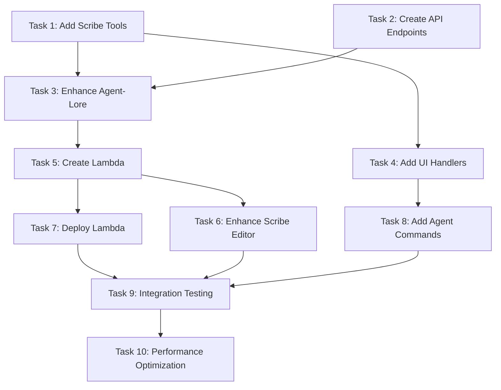

# BACKGROUND_SCRIBE_TASKS
## Implementation Task List: Real-Time Agentic Conversation Summarization

---

## Task Overview

This document provides an ordered implementation plan for the Background Scribe system using maximum reuse of existing infrastructure. The system provides call-and-response cadence conversation-to-document synthesis with sub-5 second updates.

**Architecture Strategy**: Extend existing Redis, Lambda, and Tool systems rather than building parallel infrastructure.

---

## Phase 1: Extend Existing Services (1-2 days)

### Task 1: Add Scribe Tools to ComprehensiveTools.ts
**Priority**: High | **Estimated Time**: 4 hours

#### Technical Spec
**File**: `services/tools/ComprehensiveTools.ts`

**Add Three Methods**:
```typescript
// Add to existing ComprehensiveTools class
async startScribe(params: {
  title: string;
  conversationId?: string;
  userId?: string;
  tenantId?: string;
}) {
  const correlationId = this.contextService.generateCorrelationId();
  console.log(`[${correlationId}] Starting scribe: ${params.title}`);
  
  // Create S3 text asset + Redis workflow state
  const response = await fetch('/api/chat/background-doc/start', {
    method: 'POST',
    headers: { 'Content-Type': 'application/json' },
    body: JSON.stringify({ ...params, correlationId })
  });
  
  return await response.json();
}

async toggleScribe(params: {
  conversationId: string;
  enabled: boolean;
}) {
  const correlationId = this.contextService.generateCorrelationId();
  
  // Use existing workflow state update pattern
  const workflowState = await this.contextService.getWorkflowState(params.conversationId);
  if (workflowState) {
    workflowState.context.scribeEnabled = params.enabled;
    workflowState.updatedAt = new Date().toISOString();
    await this.contextService.updateWorkflowState(workflowState);
  }
  
  return { success: true, enabled: params.enabled, correlationId };
}

async triggerScribeUpdate(params: {
  conversationId: string;
  userMessage: string;
  assistantResponse: string;
}) {
  const correlationId = this.contextService.generateCorrelationId();
  
  // Use existing Lambda invocation pattern
  const AWS = require('aws-sdk');
  const lambda = new AWS.Lambda({ region: process.env.AWS_REGION || 'us-east-1' });
  
  await lambda.invoke({
    FunctionName: 'background-summarizer',
    InvocationType: 'Event', // Async
    Payload: JSON.stringify({
      conversationId: params.conversationId,
      trigger: {
        messageId: `msg_${Date.now()}_${Math.random().toString(36).slice(2, 8)}`,
        userMessage: params.userMessage,
        assistantResponse: params.assistantResponse,
        timestamp: new Date().toISOString(),
        processed: false
      },
      correlationId
    })
  }).promise();
  
  return { triggered: true, correlationId };
}
```

**Acceptance Criteria**:
- [ ] Methods integrate with existing tool registry
- [ ] Follow established correlation ID patterns
- [ ] Use existing Redis workflow state management
- [ ] Lambda invocation follows video processor pattern

---

### Task 2: Create Background Document API Endpoints
**Priority**: High | **Estimated Time**: 6 hours

#### Technical Spec
**Files**: 
- `app/api/chat/background-doc/start/route.ts` (new)
- `app/api/chat/background-doc/toggle/route.ts` (new)

**Start Endpoint**:
```typescript
// app/api/chat/background-doc/start/route.ts
import { NextRequest, NextResponse } from 'next/server';
import { randomUUID } from 'crypto';
import { saveMediaAsset } from '@/lib/media-storage';
import { RedisContextService } from '@/services/context/RedisContextService';

export async function POST(req: NextRequest) {
  try {
    const { conversationId, title, userId = 'default-user', tenantId = 'default', correlationId } = await req.json();
    
    console.log(`[${correlationId}] Creating scribe session: ${title}`);
    
    // Create S3 text asset (existing pattern)
    const textAssetId = randomUUID();
    const slug = title.toLowerCase().replace(/[^a-z0-9\s-]/g, '').replace(/\s+/g, '-').slice(0, 50);
    const initialContent = `# ${title}\n\n*The scribe will populate this document as your conversation continues...*`;
    
    const textAsset = {
      id: textAssetId,
      media_type: 'text',
      title,
      content: initialContent,
      filename: `${slug}.md`,
      s3_url: `media-labeling/assets/${textAssetId}.json`,
      cloudflare_url: '',
      description: `Scribe document: ${title}`,
      metadata: {
        slug,
        source: 'conversation',
        status: 'draft',
        scribe_enabled: true,
        conversation_id: conversationId,
        categories: ['lore', 'conversation'],
        word_count: initialContent.split(/\s+/).length,
        character_count: initialContent.length,
        last_scribe_update: new Date().toISOString()
      },
      // ... standard MediaAsset fields
      ai_labels: { scenes: [], objects: [], style: [], mood: [], themes: [], confidence_scores: {} },
      manual_labels: { scenes: [], objects: [], style: [], mood: [], themes: [], custom_tags: [] },
      processing_status: {
        upload: 'completed',
        metadata_extraction: 'completed',
        ai_labeling: 'not_started',
        manual_review: 'pending'
      },
      timestamps: {
        uploaded: new Date().toISOString(),
        metadata_extracted: new Date().toISOString(),
        labeled_ai: null,
        labeled_reviewed: null
      },
      labeling_complete: false,
      project_id: null,
      created_at: new Date().toISOString(),
      updated_at: new Date().toISOString()
    };
    
    await saveMediaAsset(textAssetId, textAsset);
    
    // Create workflow state using existing Redis service
    const contextService = new RedisContextService();
    const workflowId = await contextService.createWorkflowState(
      userId,
      tenantId,
      'scribe_session',
      correlationId,
      {
        scribeSession: {
          conversationId,
          textAssetId,
          slug,
          title,
          scribeEnabled: true,
          lastUpdateAt: new Date().toISOString(),
          userId,
          tenantId,
          createdAt: new Date().toISOString(),
          currentContent: initialContent
        }
      }
    );
    
    console.log(`[${correlationId}] ✅ Scribe session created: ${slug}`);
    
    return NextResponse.json({
      success: true,
      textAssetId,
      slug,
      title,
      conversationId,
      workflowId,
      correlationId
    });
    
  } catch (error) {
    console.error('Background doc start failed:', error);
    return NextResponse.json(
      { success: false, error: error.message },
      { status: 500 }
    );
  }
}
```

**Toggle Endpoint**:
```typescript
// app/api/chat/background-doc/toggle/route.ts
import { NextRequest, NextResponse } from 'next/server';
import { RedisContextService } from '@/services/context/RedisContextService';

export async function POST(req: NextRequest) {
  try {
    const { conversationId, scribeEnabled, correlationId } = await req.json();
    
    console.log(`[${correlationId}] Toggling scribe for ${conversationId}: ${scribeEnabled}`);
    
    // Update workflow state using existing Redis service
    const contextService = new RedisContextService();
    const workflowState = await contextService.getWorkflowState(conversationId);
    
    if (!workflowState) {
      return NextResponse.json(
        { success: false, error: 'Scribe session not found' },
        { status: 404 }
      );
    }
    
    // Update scribe enabled state
    workflowState.context.scribeSession.scribeEnabled = scribeEnabled;
    workflowState.updatedAt = new Date().toISOString();
    
    await contextService.updateWorkflowState(workflowState);
    
    console.log(`[${correlationId}] ✅ Scribe toggled: ${scribeEnabled}`);
    
    return NextResponse.json({
      success: true,
      scribeEnabled,
      conversationId,
      correlationId
    });
    
  } catch (error) {
    console.error('Background doc toggle failed:', error);
    return NextResponse.json(
      { success: false, error: error.message },
      { status: 500 }
    );
  }
}
```

**Acceptance Criteria**:
- [ ] Endpoints use existing Redis workflow state pattern
- [ ] S3 text asset creation follows existing MediaAsset structure
- [ ] Correlation IDs flow through all operations
- [ ] Error handling matches existing API patterns

---

### Task 3: Enhance Agent-Lore Route with Scribe Triggers
**Priority**: High | **Estimated Time**: 4 hours

#### Technical Spec
**File**: `app/api/agent-lore/route.ts`

**Add Scribe Trigger Logic**:
```typescript
// Add after successful chat response streaming
if (scribeEnabled && conversationId) {
  try {
    // Use existing tool system to trigger Lambda
    const tools = new ComprehensiveTools(contextService);
    
    // Capture the complete assistant response (need to collect from stream)
    const assistantResponse = await captureStreamedResponse(chatResponse);
    
    await tools.triggerScribeUpdate({
      conversationId,
      userMessage: lastMessage.content,
      assistantResponse,
      correlationId
    });
    
    console.log(`[${correlationId}] ✅ Scribe update triggered for ${conversationId}`);
  } catch (error) {
    console.warn(`[${correlationId}] Scribe trigger failed (non-blocking):`, error);
    // Don't fail the chat response if scribe fails
  }
}
```

**Stream Capture Helper**:
```typescript
async function captureStreamedResponse(response: Response): Promise<string> {
  const reader = response.body?.getReader();
  if (!reader) return '';
  
  const decoder = new TextDecoder();
  let fullResponse = '';
  let buffer = '';
  
  while (true) {
    const { done, value } = await reader.read();
    if (done) break;
    
    const chunk = decoder.decode(value, { stream: true });
    buffer += chunk;
    const lines = buffer.split('\n');
    buffer = lines.pop() || '';
    
    for (const line of lines) {
      if (line.startsWith('data: ')) {
        try {
          const data = JSON.parse(line.slice(6));
          if (data.type === 'content') {
            fullResponse += data.delta;
          }
        } catch {}
      }
    }
  }
  
  return fullResponse;
}
```

**Acceptance Criteria**:
- [ ] Scribe triggers fire immediately after chat responses
- [ ] Uses existing ComprehensiveTools for Lambda invocation
- [ ] Follows existing correlation ID tracing
- [ ] Non-blocking - chat works even if scribe fails

---

### Task 4: Add Scribe UI Handlers to Workshop
**Priority**: High | **Estimated Time**: 3 hours

#### Technical Spec
**File**: `app/workshop/page.tsx`

**Add to Existing __agentApi**:
```typescript
// Add to existing window.__agentApi object
window.__agentApi = {
  // ... existing handlers (searchUnified, pinToCanvas, etc.) ...
  
  startScribe: async (payload) => {
    try {
      console.log(`[${payload.correlationId}] UI: Starting scribe`);
      
      const response = await fetch('/api/chat/background-doc/start', {
        method: 'POST',
        headers: { 'Content-Type': 'application/json' },
        body: JSON.stringify(payload)
      });
      
      if (!response.ok) throw new Error(`Start scribe failed: ${response.status}`);
      
      const result = await response.json();
      
      // Show success notification (existing pattern)
      showToast(`✅ Scribe started for "${result.title}"`);
      
      // Acknowledge completion (existing pattern)
      await fetch('/api/agent/ack', {
        method: 'POST',
        headers: { 'Content-Type': 'application/json' },
        body: JSON.stringify({
          correlationId: payload.correlationId,
          step: 'startscribe',
          artifacts: { textAssetId: result.textAssetId, slug: result.slug }
        })
      });
      
      console.log(`[${payload.correlationId}] ✅ startScribe ack sent`);
      return result;
      
    } catch (error) {
      console.error(`[${payload.correlationId}] startScribe failed:`, error);
      showToast(`❌ Failed to start scribe: ${error.message}`);
      throw error;
    }
  },
  
  toggleScribe: async (payload) => {
    try {
      console.log(`[${payload.correlationId}] UI: Toggling scribe`);
      
      const response = await fetch('/api/chat/background-doc/toggle', {
        method: 'POST',
        headers: { 'Content-Type': 'application/json' },
        body: JSON.stringify(payload)
      });
      
      if (!response.ok) throw new Error(`Toggle scribe failed: ${response.status}`);
      
      const result = await response.json();
      
      // Show status notification (existing pattern)
      showToast(`${result.enabled ? '✅ Scribe enabled' : '⏸️ Scribe paused'}`);
      
      // Acknowledge completion (existing pattern)
      await fetch('/api/agent/ack', {
        method: 'POST',
        headers: { 'Content-Type': 'application/json' },
        body: JSON.stringify({
          correlationId: payload.correlationId,
          step: 'togglescribe',
          artifacts: { enabled: result.enabled }
        })
      });
      
      console.log(`[${payload.correlationId}] ✅ toggleScribe ack sent`);
      return result;
      
    } catch (error) {
      console.error(`[${payload.correlationId}] toggleScribe failed:`, error);
      showToast(`❌ Failed to toggle scribe: ${error.message}`);
      throw error;
    }
  }
};
```

**Acceptance Criteria**:
- [ ] Handlers follow existing __agentApi patterns
- [ ] Use existing showToast notification system
- [ ] Follow existing acknowledgment loop with correlation IDs
- [ ] Error handling matches existing tool handlers

---

## Phase 2: Lambda Background Worker (1 day)

### Task 5: Create Lambda Background Summarizer
**Priority**: High | **Estimated Time**: 6 hours

#### Technical Spec
**Directory**: `lambda-background-summarizer/` (copy from `lambda-video-processor/`)

**Main Handler**:
```javascript
// lambda-background-summarizer/index.js
const { getOpenAIClient } = require('./lib/openai-client');
const { getS3Client, getBucketName } = require('./lib/s3-config');
const { readJsonFromS3, writeJsonToS3 } = require('./lib/s3-utils');

exports.handler = async (event) => {
  const { conversationId, trigger, correlationId } = event;
  
  console.log(`[${correlationId}] Background summarizer triggered`);
  console.log(`[${correlationId}] Conversation: ${conversationId}`);
  console.log(`[${correlationId}] Message: ${trigger.messageId}`);
  
  try {
    // Get workflow state from Redis (existing pattern)
    const workflowState = await getWorkflowStateFromRedis(conversationId);
    if (!workflowState?.context?.scribeSession?.scribeEnabled) {
      console.log(`[${correlationId}] Scribe disabled, skipping`);
      return { statusCode: 200, body: 'Scribe disabled' };
    }
    
    const session = workflowState.context.scribeSession;
    
    // Load current S3 text asset (existing pattern)
    const assetKey = `media-labeling/assets/${session.textAssetId}.json`;
    const currentAsset = await readJsonFromS3(assetKey);
    
    if (!currentAsset) {
      throw new Error(`Text asset ${session.textAssetId} not found`);
    }
    
    // Generate narrative update using OpenAI
    const conversationTurn = `User: ${trigger.userMessage}\n\nAssistant: ${trigger.assistantResponse}`;
    const updatedContent = await generateRealtimeUpdate(
      conversationTurn,
      currentAsset.content || '',
      session.title,
      correlationId
    );
    
    // Update S3 text asset (existing pattern)
    const updatedAsset = {
      ...currentAsset,
      content: updatedContent,
      updated_at: new Date().toISOString(),
      metadata: {
        ...currentAsset.metadata,
        last_scribe_update: new Date().toISOString(),
        last_message_id: trigger.messageId,
        correlation_id: correlationId
      }
    };
    
    await writeJsonToS3(assetKey, updatedAsset);
    
    // Update workflow state (existing pattern)
    session.lastUpdateAt = new Date().toISOString();
    session.currentContent = updatedContent;
    await updateWorkflowStateInRedis(conversationId, workflowState);
    
    // Trigger OAI sync (existing pattern)
    try {
      await triggerOAISync(session.textAssetId, updatedContent, session.slug);
      console.log(`[${correlationId}] ✅ OAI sync triggered`);
    } catch (oaiError) {
      console.warn(`[${correlationId}] OAI sync failed (non-blocking):`, oaiError);
    }
    
    console.log(`[${correlationId}] ✅ Scribe update completed: ${session.slug}`);
    
    return {
      statusCode: 200,
      body: JSON.stringify({
        success: true,
        updated: session.slug,
        contentLength: updatedContent.length,
        correlationId
      })
    };
    
  } catch (error) {
    console.error(`[${correlationId}] ❌ Summarizer failed:`, error);
    return {
      statusCode: 500,
      body: JSON.stringify({
        error: error.message,
        correlationId
      })
    };
  }
};

async function generateRealtimeUpdate(conversationTurn, existingContent, documentTitle, correlationId) {
  console.log(`[${correlationId}] Generating narrative update`);
  
  const openai = getOpenAIClient();
  
  const systemPrompt = `You are a real-time narrative synthesizer for the Starholder universe. 
Take this single conversation turn and seamlessly weave it into the existing document. 
Write in flowing, engaging prose that captures the essence of the discussion.
Maintain narrative coherence while integrating new information naturally.
Respond with the complete updated document.`;

  const updatePrompt = `
DOCUMENT TITLE: ${documentTitle}

CURRENT DOCUMENT:
${existingContent}

NEW CONVERSATION TURN TO INTEGRATE:
${conversationTurn}

TASK: Seamlessly integrate this conversation turn into the document. Maintain the flow and add new insights naturally. Return the complete updated document.
`;

  const response = await openai.chat.completions.create({
    model: 'gpt-4o',
    messages: [
      { role: 'system', content: systemPrompt },
      { role: 'user', content: updatePrompt }
    ],
    temperature: 0.7,
    max_tokens: 8000
  });

  return response.choices[0]?.message?.content || existingContent;
}
```

**Package.json** (copy from video processor):
```json
{
  "name": "background-summarizer",
  "version": "1.0.0",
  "main": "index.js",
  "dependencies": {
    "aws-sdk": "^2.1000.0",
    "openai": "^4.0.0",
    "ioredis": "^5.0.0"
  }
}
```

**Dockerfile** (copy from video processor):
```dockerfile
FROM public.ecr.aws/lambda/nodejs:18

COPY package*.json ./
RUN npm ci --only=production

COPY . .

CMD ["index.handler"]
```

**Acceptance Criteria**:
- [ ] Lambda follows existing worker patterns (video processor structure)
- [ ] Uses existing S3 client and OpenAI client utilities
- [ ] Integrates with existing Redis workflow state
- [ ] Follows existing correlation ID tracing
- [ ] Triggers existing OAI sync pipeline
- [ ] Completes execution in <2 seconds

---

### Task 6: Enhance Scribe Editor with Real-Time Updates
**Priority**: Medium | **Estimated Time**: 4 hours

#### Technical Spec
**File**: `components/lore/LoreScribeModal.tsx` (ScribeEditor component)

**Add Real-Time Polling**:
```typescript
// Add to existing ScribeEditor component
const ScribeEditor = ({ documentData, scribeEnabled, onScribeToggle, onSave }) => {
  const [lastScribeUpdate, setLastScribeUpdate] = useState<string | null>(null);
  const [isUpdating, setIsUpdating] = useState(false);
  
  // Poll for scribe updates (existing polling pattern)
  useEffect(() => {
    if (!scribeEnabled || !documentData?.id) return;
    
    const interval = setInterval(async () => {
      try {
        setIsUpdating(true);
        
        // Check if document has been updated by background service
        const response = await fetch(`/api/media-assets/${documentData.id}`, {
          cache: 'no-store'
        });
        
        if (response.ok) {
          const data = await response.json();
          const asset = data.asset;
          const lastUpdate = asset?.metadata?.last_scribe_update;
          
          if (lastUpdate && lastUpdate !== lastScribeUpdate) {
            console.log('📝 Scribe update detected, refreshing content');
            setLastScribeUpdate(lastUpdate);
            
            // Update content (preserve user cursor position)
            setContent(asset.content || '');
            
            // Show subtle notification
            showToast('📝 Document updated by scribe', { duration: 2000 });
          }
        }
      } catch (error) {
        console.error('Failed to check for scribe updates:', error);
      } finally {
        setIsUpdating(false);
      }
    }, 5000); // Poll every 5 seconds
    
    return () => clearInterval(interval);
  }, [scribeEnabled, documentData?.id, lastScribeUpdate]);
  
  // Enhanced header with scribe status
  const renderHeader = () => (
    <div className="flex justify-between items-center p-4 border-b border-neutral-800">
      <div>
        <h3 className="text-lg font-semibold text-white">
          {documentData?.title || 'Untitled Document'}
        </h3>
        <div className="flex items-center gap-2 text-sm text-neutral-400">
          <div className={`w-2 h-2 rounded-full ${
            scribeEnabled 
              ? isUpdating 
                ? 'bg-yellow-500 animate-pulse' 
                : 'bg-green-500'
              : 'bg-neutral-600'
          }`} />
          <span>
            {scribeEnabled 
              ? isUpdating 
                ? 'AI updating document...' 
                : 'AI monitoring conversation'
              : 'Manual editing mode'
            }
          </span>
          {lastScribeUpdate && (
            <span className="text-xs">
              Last update: {new Date(lastScribeUpdate).toLocaleTimeString()}
            </span>
          )}
        </div>
      </div>
      
      <div className="flex gap-2">
        <Button
          onClick={handleToggleScribe}
          variant={scribeEnabled ? "destructive" : "default"}
          size="sm"
          disabled={isToggling}
        >
          {isToggling 
            ? '⏳' 
            : scribeEnabled 
              ? "Stop Scribe" 
              : "Start Scribe"
          }
        </Button>
        {/* ... other existing buttons ... */}
      </div>
    </div>
  );
  
  // ... rest of existing component
};
```

**Acceptance Criteria**:
- [ ] Real-time polling shows scribe updates within 5-10 seconds
- [ ] Status indicators show scribe state clearly
- [ ] Updates preserve user cursor position and unsaved changes
- [ ] Uses existing notification system for update alerts
- [ ] Follows existing component patterns and styling

---

## Phase 3: Production Deployment (1 day)

### Task 7: Deploy Lambda Function
**Priority**: High | **Estimated Time**: 4 hours

#### Technical Spec
**Build Script** (copy from existing):
```bash
#!/bin/bash
# scripts/deploy-background-summarizer.sh

cd lambda-background-summarizer

# Build and package
npm ci --only=production
zip -r background-summarizer.zip .

# Deploy to AWS
aws lambda create-function \
  --function-name background-summarizer \
  --runtime nodejs18.x \
  --role arn:aws:iam::ACCOUNT:role/lambda-execution-role \
  --handler index.handler \
  --zip-file fileb://background-summarizer.zip \
  --timeout 30 \
  --memory-size 1024 \
  --environment Variables='{
    "REDIS_URL":"'$REDIS_URL'",
    "OPENAI_API_KEY":"'$OPENAI_API_KEY'",
    "S3_BUCKET":"'$S3_BUCKET'"
  }'

# Update function code for subsequent deploys
aws lambda update-function-code \
  --function-name background-summarizer \
  --zip-file fileb://background-summarizer.zip

echo "✅ Lambda deployed successfully"
```

**Infrastructure** (add to existing):
```yaml
# infrastructure/background-summarizer.yml
Resources:
  BackgroundSummarizerFunction:
    Type: AWS::Lambda::Function
    Properties:
      FunctionName: background-summarizer
      Runtime: nodejs18.x
      Handler: index.handler
      Role: !Ref LambdaExecutionRole
      Timeout: 30
      MemorySize: 1024
      Environment:
        Variables:
          REDIS_URL: !Ref RedisConnectionString
          OPENAI_API_KEY: !Ref OpenAIApiKey
          S3_BUCKET: !Ref MediaBucket
```

**Acceptance Criteria**:
- [ ] Lambda deploys successfully with existing IAM roles
- [ ] Environment variables match existing Lambda functions
- [ ] Function executes within 30-second timeout
- [ ] CloudWatch logs show correlation ID tracing
- [ ] Integration with existing Redis and S3 infrastructure

---

### Task 8: Add Scribe Commands to Agent Intent Detection
**Priority**: Medium | **Estimated Time**: 2 hours

#### Technical Spec
**File**: `components/AgentChat.tsx`

**Enhance Intent Classification**:
```typescript
// Add to existing conversationalPatterns array
const conversationalPatterns = [
  // ... existing patterns ...
  
  // Scribe command patterns (conversational, not task)
  /\b(start|begin|create|activate|enable)\s+(scribe|background\s+doc|document|documentation)\b/i,
  /\b(stop|end|pause|disable|deactivate)\s+(scribe|background\s+doc|document|documentation)\b/i,
  /\b(toggle|switch|turn\s+on|turn\s+off)\s+(scribe|background\s+doc|document|documentation)\b/i,
];
```

**Acceptance Criteria**:
- [ ] Scribe commands route to conversational agent (modal)
- [ ] Commands trigger existing scribe intent detection
- [ ] Modal opens when scribe commands are detected
- [ ] Integration with existing intent classification system

---

## Phase 4: Testing & Polish (1 day)

### Task 9: End-to-End Integration Testing
**Priority**: High | **Estimated Time**: 4 hours

#### Test Scenarios
1. **Start Scribe Flow**:
   - User: "start scribe about magical wizards"
   - Expected: S3 text asset created, workflow state registered, modal switches to scribe tab

2. **Real-Time Updates**:
   - User asks questions about wizards in lore tab
   - Expected: Scribe document updates within 5 seconds, visible in scribe tab

3. **Toggle Scribe**:
   - User clicks "Stop Scribe" in scribe tab
   - Expected: Background updates pause, status indicator changes

4. **Continue Conversation**:
   - User clicks "Continue Conversation" on existing scribe document
   - Expected: Modal opens with document loaded, lore agent has context

**Acceptance Criteria**:
- [ ] All flows work end-to-end with correlation ID tracing
- [ ] Performance meets <5 second update targets
- [ ] Error handling gracefully degrades on failures
- [ ] UI remains stable during background updates

---

### Task 10: Performance Optimization
**Priority**: Medium | **Estimated Time**: 3 hours

#### Optimizations
- **Lambda Cold Start**: Pre-warm function with scheduled pings
- **Redis Caching**: Cache workflow states in Lambda memory
- **S3 Optimization**: Use parallel reads/writes for asset operations
- **UI Debouncing**: Prevent excessive polling during rapid conversations

**Acceptance Criteria**:
- [ ] Lambda cold starts < 1 second
- [ ] S3 operations complete < 500ms
- [ ] UI polling doesn't impact chat responsiveness
- [ ] System handles rapid-fire conversations gracefully

---

## Task Dependencies



---

## Success Metrics

### Functional Requirements
- [ ] "start scribe" creates document and enables real-time updates
- [ ] Documents update within 5 seconds of conversation turns
- [ ] "stop scribe" pauses updates, "start scribe" resumes
- [ ] Continue Conversation button loads existing documents
- [ ] All operations trace with correlation IDs

### Performance Requirements
- [ ] Lambda execution < 2 seconds per conversation turn
- [ ] S3 text asset updates < 1 second
- [ ] UI shows updates within 5 seconds of user message
- [ ] System handles 10+ concurrent scribe sessions

### Integration Requirements
- [ ] Uses existing Redis workflow state patterns
- [ ] Follows existing Lambda worker architecture
- [ ] Integrates with existing tool registry and UI handlers
- [ ] Maintains existing error handling and retry logic

---

This task list leverages your existing battle-tested infrastructure to deliver real-time agentic conversation summarization with minimal new code and maximum reliability.
