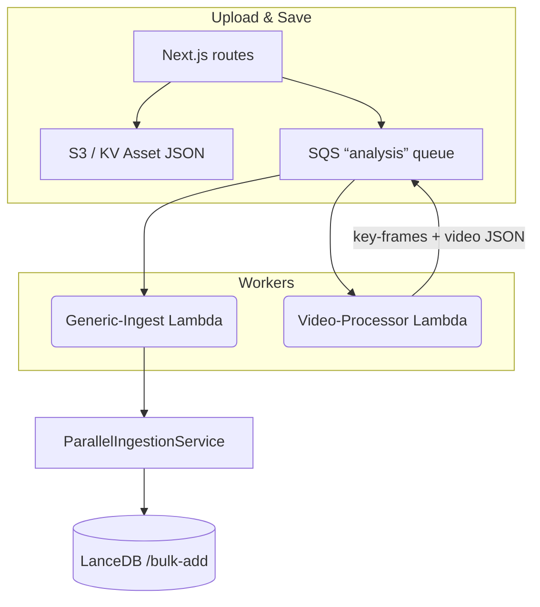

# Unified Production Parallel Ingestion – Specification

_Last updated: 2025-08-06_

## Objective
Create a single, durable ingestion pipeline that pushes **all** searchable content – text files (MDX), images, key-frames, audio tracks, and videos – into LanceDB automatically.  The solution must:

* Keep heavy processing (FFmpeg, multiple OpenAI calls) off Vercel edge.
* Stay easy to extend (new media types = one worker switch-case).
* Stay observable & recoverable (SQS retries, DLQ alarms).

---

## High-Level Architecture



* **Generic-Ingest Lambda** – consumes any `mediaType` except raw video.
* **Video-Processor Lambda** – existing FFmpeg worker; after it finishes it emits normal `image` (key-frame) + `video` messages for the generic worker.
* **ParallelIngestionService** – single library that turns a MediaAsset (or text blob) into a LanceDB record and calls `/bulk-add`.

---

## Standard Queue Payload

```jsonc
{
  "assetId": "<uuid-or-slug>",
  "mediaType": "image|video|audio|text|keyframe",
  "requestedAt": 1691352890123,
  "stage": "initial|post_label|refresh",   // optional – worker treats all the same now
  "extra": { /* type-specific */ }
}
```

* Idempotent – `id` is the primary key in LanceDB, so re-ingests replace the row.
* `stage:"refresh"` is sent by PATCH routes so edits are reflected.

---

## Source-Side Changes

| Route / Event | Action |
|---------------|--------|
| **Images** – `/media-labeling/images/finish-upload` | Save JSON only (no queue). |
| **Images** – `performAiLabeling()` (after labels) | `enqueueAnalysisJob(mediaType:"image")` |
| **Key-frames** – `update-keyframes` (after labels) | already enqueues via same call. |
| **Videos** – `/videos/finish-upload` | _unchanged_: enqueue `mediaType:"video"` for FFmpeg worker. |
| **Audio** – `/audio-labeling/finish-upload` | **NEW** enqueue `mediaType:"audio"` after JSON write. |
| **Text** – `/sync-content` webhook | already enqueues `mediaType:"text"`. |
| **PATCH** routes (assets, songs, projects) | add `stage:"refresh"` enqueue. |

---

## Worker Responsibilities

### Video-Processor Lambda (existing)
1. Extract key-frames.
2. Upload key-frame JPGs & JSON.
3. Emit SQS messages for each key-frame (`image`) and for the video JSON (`video`).

### Generic-Ingest Lambda (new)
```ts
switch(job.mediaType) {
  case 'text':     const text = fetchText(job); ingestText(text); break;
  case 'audio':
  case 'image':
  case 'keyframe':
  case 'video':    const asset = fetchAssetJSON(job.assetId); await ingestAsset(asset);
}
```
* Uses `ingestAsset()` helper → `ParallelIngestionService`.
* Retries via SQS; fails move to DLQ.

---

## Library Refactor (Phase 1)
1. Remove `import '../scripts/bootstrap-env'` from `lib/parallel-ingestion.ts`.
2. Move to `lib/ingestion/ParallelIngestionService.ts`.
3. Add `lib/ingestion/index.ts`:
```ts
import { ParallelIngestionService } from './ParallelIngestionService';
const svc = new ParallelIngestionService();
export async function ingestAsset(a: MediaAsset){
  return svc.ingestWithOptimizations([
    ParallelIngestionService.mediaAssetToContentItem(a)
  ]);
}
```

---

## Deployment & Ops
* **Env Vars needed in Vercel & Lambda**
  * `SQS_QUEUE_URL`
  * `LANCEDB_API_URL`
  * `OPENAI_API_KEY`
* **SQS settings** – Visibility ≥ expected processing time (e.g. 5 minutes).
* **CloudWatch** – Alarm on DLQ depth > 0.
* **Back-fill** – run `scripts/unified-parallel-production.ts` once to place all historical assets/text into the queue.
* **Index** – call `/build-index` after back-fill.

---

## Phased Roll-out Checklist

1. [ ] Phase 1 – move library & helper.
2. [ ] Phase 2 – standardise queue payload, update all enqueuers (image label, audio upload, PATCH, webhook).
3. [ ] Phase 3 – implement Generic-Ingest Lambda, deploy.
4. [ ] Phase 4 – remove obsolete direct ingestion paths (if any).
5. [ ] Phase 5 – run back-fill script, build IVFFlat index.
6. [ ] Phase 6 – add monitoring & docs.

---

## Future Enhancements
* CLIP or BLIP visual embeddings for images & key-frames.
* Automatic re-index when manual labels get bulk-edited.
* Streaming ingestion metrics endpoint (`/api/debug-ingestion`).
