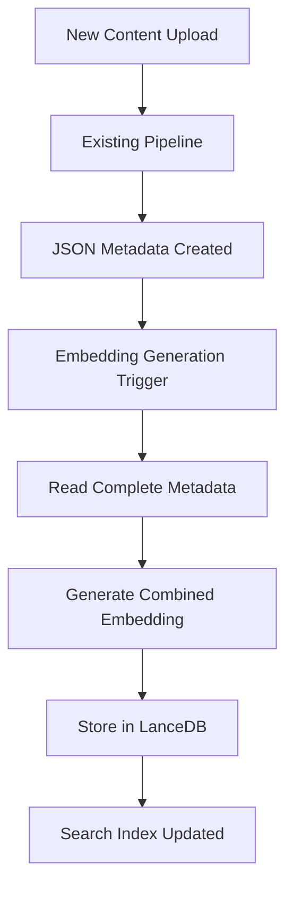
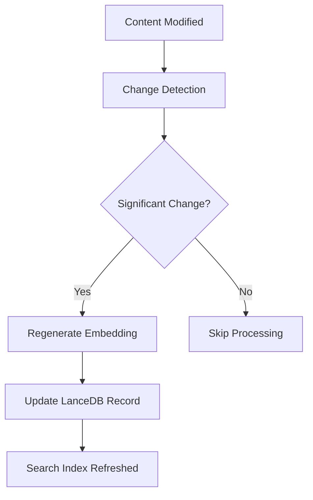
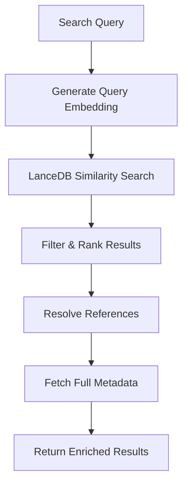

# Unified Semantic Layer - Product Specification & Implementation Plan

## Executive Summary

This specification outlines the implementation of a unified semantic layer for the HH-Bot system using LanceDB OSS. The goal is to create cross-modal semantic search capabilities across all content types (images, audio, video, text) while leveraging the existing robust metadata pipeline and storage infrastructure.

**Key Innovation**: Rather than replacing existing systems, the semantic layer sits above them, providing vector similarity search that references back to the authoritative metadata and content stores.

---

## Product Goals

### Primary Objectives
1. **Enable Cross-Modal Search**: Query "find images that match this text's mood" or "find audio similar to this video's theme"
2. **Support Context-Aware Generation**: Provide semantic context for AI content generation prompts
3. **Enable Recursive Content Loop**: Allow generated content to be semantically indexed and discovered
4. **Preserve Existing Investment**: Leverage all existing labeling, metadata, and storage work

### Success Metrics
- **Search Relevance**: >80% user satisfaction with semantic search results
- **Performance**: <300ms average search response time
- **Scale**: Support 1M+ embeddings without degradation
- **Integration**: Zero disruption to existing upload/labeling workflows

---

## System Architecture

### Current State
```
Media Pipeline: S3 Assets → JSON Metadata → Basic Search
Text Pipeline: Markdown → OpenAI Vector Store → Chat Context
```

### Target Architecture
```
┌─────────────────────────────────────────────────────┐
│              LanceDB Semantic Layer                 │
│   (Embeddings + References to Existing Systems)     │
└─────────────────┬───────────────────────────────────┘
                  │ Unified Search API
        ┌─────────┴─────────┐
        │                   │
┌───────▼────────┐  ┌───────▼────────┐
│  Media Assets  │  │  Text Content  │
│  S3 + JSON     │  │  Markdown +    │
│  (Unchanged)   │  │  OpenAI Store  │
└────────────────┘  └────────────────┘
```

### Core Components

#### 1. LanceDB Service (ECS/Fargate)
- **Deployment**: AWS ECS with Fargate compute
- **Storage**: EFS for persistent vector indices
- **Scaling**: Auto-scaling based on query load
- **API**: HTTP REST interface for embedding operations

#### 2. Embedding Generation Pipeline
- **Text**: OpenAI text-embedding-3-small with cleaned content processing
- **Images**: OpenCLIP for visual semantic understanding
- **Audio**: Wav2CLIP for audio-visual semantic alignment
- **Video**: Combined keyframe + audio + metadata embeddings

#### 3. Text Content Processing (CRITICAL)
- **Cleaning**: Remove markdown formatting, code blocks, frontmatter
- **Normalization**: Standardize whitespace and line breaks
- **Semantic Focus**: Extract meaningful content for embedding
- **Validation**: Ensure embeddings represent actual semantic content

#### 4. Unified Search API
- **Endpoint**: `/api/semantic-search`
- **Capabilities**: Text queries, image similarity, cross-modal search
- **Response**: Ranked results with references to original content

---

## Technical Specifications

### Critical Implementation Notes

#### Text Embedding Processing (RESOLVED)
**Issue**: Raw markdown content was being embedded without cleaning, causing irrelevant results with high similarity scores.

**Solution**: Implemented cleaned text processing before embedding:
```typescript
const cleanContent = content.content
  .replace(/```[\s\S]*?```/g, '') // Remove code blocks
  .replace(/`[^`]*`/g, '') // Remove inline code
  .replace(/\[([^\]]*)\]\([^)]*\)/g, '$1') // Convert links to text
  .replace(/!\[([^\]]*)\]\([^)]*\)/g, '$1') // Convert images to text
  .replace(/[#*_~`]/g, '') // Remove markdown formatting
  .replace(/\n+/g, ' ') // Normalize line breaks
  .replace(/\s+/g, ' ') // Normalize whitespace
  .trim();
```

**Results**:
- ✅ 342 text files re-ingested with cleaned embeddings
- ✅ Search relevance restored (relevant results now rank properly)
- ✅ System integrity maintained (no workarounds, proper fix)

### LanceDB Record Schema

```typescript
interface SemanticRecord {
  // Identity and type
  id: string;                          // Asset ID from existing system
  content_type: 'image' | 'audio' | 'video' | 'text';

  // The semantic vector (core value-add)
  embedding: number[];                 // 1536-dimensional vector

  // References to existing systems (not duplication)
  references: {
    content_url: string;               // S3 URL or file path
    metadata_path: string;             // JSON metadata location
    cdn_url?: string;                  // CloudFlare URL if available
  };

  // Minimal denormalized fields for query performance
  title: string;
  content_hash: string;                // For change detection
  last_updated: string;

  // Optional: key searchable terms for hybrid search
  searchable_text?: string;            // Combined metadata text
}
```

### Embedding Generation Strategy

#### Video Content Processing
```typescript
// For videos with rich metadata packages
async function generateVideoEmbedding(videoMetadata) {
  const combinedText = [
    videoMetadata.video_description,
    ...videoMetadata.keyframes.map(kf => kf.description),
    ...videoMetadata.tags,
    ...videoMetadata.themes
  ].join(' ');

  const embedding = await generateTextEmbedding(combinedText);
  return embedding;
}
```

#### Image Content Processing
```typescript
async function generateImageEmbedding(imageAsset) {
  // Option 1: Text-based (from existing AI labels)
  if (imageAsset.ai_labels) {
    const combinedText = [
      ...imageAsset.ai_labels.scenes,
      ...imageAsset.ai_labels.objects,
      ...imageAsset.ai_labels.style,
      ...imageAsset.ai_labels.mood,
      ...imageAsset.ai_labels.themes
    ].join(' ');
    return await generateTextEmbedding(combinedText);
  }

  // Option 2: Visual-based (future enhancement)
  // return await generateVisualEmbedding(imageAsset.s3_url);
}
```

---

## Implementation Plan

**Total Timeline: 6 weeks (cloud-first approach)**

### Phase 1: Production Infrastructure (Weeks 1-2)
**Goal**: ECS/Fargate LanceDB service with basic functionality

#### Week 1: ECS/Fargate Foundation
- [ ] Create Docker container for LanceDB service with HTTP API
- [ ] Configure EFS for persistent vector storage
- [ ] Set up ECS task definition and service
- [ ] Implement basic LanceDB operations (add, search, delete)
- [ ] Deploy initial service with health checks and monitoring

#### Week 2: Core Embedding Pipeline
- [ ] Implement embedding generation for text content
- [ ] Add embedding generation for images (text-based from AI labels)
- [ ] Create video metadata embedding support
- [ ] Build bulk ingestion API endpoints
- [ ] Test with subset of existing content in production environment

**Deliverable**: Production-ready LanceDB service with basic embedding capabilities

### Phase 2: System Integration (Weeks 3-4)
**Goal**: Complete integration with existing pipelines

#### Week 3: Automated Ingestion
- [ ] Create S3 event handlers for new media uploads
- [ ] Implement incremental sync for markdown changes
- [ ] Build content change detection (hash-based)
- [ ] Add bulk re-processing capabilities for existing content
- [ ] Configure auto-scaling policies based on ingestion load

#### Week 4: Unified Search API
- [ ] Build unified search endpoint that queries LanceDB + resolves references
- [ ] Implement search result ranking and filtering
- [ ] Add support for complex query types (text, image similarity, cross-modal)
- [ ] Create search analytics and performance monitoring
- [ ] Load test search performance and optimize

**Deliverable**: Complete semantic search system integrated with existing content

### Phase 3: Advanced Features & Optimization (Weeks 5-6)
**Goal**: Enhanced search capabilities and production hardening

#### Week 5: Search Enhancement
- [ ] Implement hybrid search (semantic + keyword)
- [ ] Add search result clustering and categorization
- [ ] Create "find related content" recommendations
- [ ] Build search query suggestions and auto-complete
- [ ] Add advanced filtering and sorting options

#### Week 6: Production Hardening
- [ ] Optimize embedding generation pipeline for scale
- [ ] Implement search result caching and query optimization
- [ ] Add comprehensive monitoring, alerting, and dashboards
- [ ] Load test and tune auto-scaling policies
- [ ] Implement backup, disaster recovery, and security hardening

**Deliverable**: Production-optimized semantic search with advanced features and enterprise-grade reliability

---

## Infrastructure Requirements

### Development Environment
- **LanceDB Service**: Cloud-first development using ECS/Fargate
- **Local Compute**: Standard development machine for API development
- **Dependencies**: Docker, AWS CLI, Node.js for API client development

### Production Environment

#### ECS/Fargate Configuration
```yaml
# Production scaling targets
Service Configuration:
  Desired Count: 2
  Min Capacity: 1
  Max Capacity: 10

Task Definition:
  CPU: 2048 (2 vCPU)
  Memory: 8192 (8GB)
  Storage: EFS volume for persistence

Auto Scaling:
  Target CPU: 70%
  Target Memory: 80%
  Scale-in cooldown: 300s
  Scale-out cooldown: 60s
```

#### Storage Requirements
- **EFS**: 100GB initial allocation (expandable)
- **S3**: Existing bucket usage (no additional storage)
- **Backup**: Daily EFS snapshots

#### Cost Estimates (Monthly)
- **Fargate**: ~$200-400 (2-4 containers, variable usage)
- **EFS**: ~$30 (100GB standard storage)
- **Data Transfer**: ~$50 (based on search volume)
- **Total**: ~$300-500/month at moderate scale

---

## Integration Points

### Existing System Compatibility

#### Media Labeling System
```typescript
// Current upload flow (unchanged)
Upload → S3 → Metadata Extraction → JSON Storage → UI Update

// New addition (automatic)
JSON Storage → Trigger → Embedding Generation → LanceDB Update
```

#### Timeline Content System
```typescript
// Current flow (unchanged)
Markdown Edit → Git Commit → OpenAI Vector Store Sync

// New addition (parallel)
Git Commit → Trigger → Embedding Generation → LanceDB Update
```

#### Chat System
```typescript
// Current (unchanged)
Chat Query → OpenAI Vector Store → Timeline Context

// New capability (additional)
Chat Query → LanceDB Search → Multi-modal Context
```

### API Integration

#### New Search Endpoint
```typescript
POST /api/semantic-search
{
  query: "mountain sunset with dramatic music",
  types: ["image", "video", "text"],  // optional filter
  limit: 10,
  threshold: 0.7
}

Response:
{
  results: [
    {
      id: "asset-123",
      type: "video",
      title: "Mountain Sunset Timelapse",
      score: 0.95,
      references: {
        content_url: "s3://bucket/videos/mountain-sunset.mp4",
        metadata_path: "s3://bucket/metadata/video-123.json"
      }
    }
  ]
}
```

#### Enhanced Media API
```typescript
// Extend existing media endpoints
GET /api/media-labeling/assets/:id/related
// Returns semantically similar content using LanceDB
```

---

## Data Flow Specifications

### Embedding Generation Pipeline

#### New Content Processing


#### Content Update Processing


### Search Query Processing


---

## Quality Assurance & Testing

### Testing Strategy

#### Unit Tests
- [ ] Embedding generation functions (API-based testing)
- [ ] LanceDB HTTP API operations (CRUD)
- [ ] Search result ranking algorithms
- [ ] Reference resolution logic

#### Integration Tests
- [ ] End-to-end search workflows in cloud environment
- [ ] Content ingestion pipelines with ECS triggers
- [ ] Change detection mechanisms
- [ ] Error handling and recovery scenarios

#### Performance Tests
- [ ] Search latency under load (cloud-based load testing)
- [ ] Concurrent embedding generation at scale
- [ ] ECS auto-scaling behavior validation
- [ ] EFS storage and memory usage optimization

#### Data Quality Tests
- [ ] Search relevance evaluation
- [ ] Embedding consistency validation
- [ ] Cross-modal search accuracy
- [ ] Reference integrity checks

### Monitoring & Alerting

#### Key Metrics
- **Search Performance**: Query latency, throughput, error rates
- **Data Quality**: Embedding generation success rate, search relevance scores
- **System Health**: Container memory/CPU usage, EFS performance
- **Business Metrics**: Search usage patterns, user satisfaction

#### Alert Conditions
- Search latency > 500ms for 5 minutes
- Embedding generation failure rate > 5%
- ECS service unhealthy containers
- EFS storage utilization > 90%

---

## Risk Assessment & Mitigation

### Technical Risks

#### High Memory Usage (Vector Operations)
- **Risk**: LanceDB operations consuming excessive memory
- **Mitigation**: Implement memory monitoring, optimize batch sizes, use swap if needed

#### Search Performance Degradation
- **Risk**: Search latency increases with index size
- **Mitigation**: Implement result caching, optimize indexing strategy, consider index partitioning

#### Data Synchronization Issues
- **Risk**: LanceDB and source data becoming out of sync
- **Mitigation**: Implement change detection, periodic reconciliation jobs, monitoring alerts

### Operational Risks

#### ECS Service Failures
- **Risk**: Fargate containers failing or becoming unavailable
- **Mitigation**: Multi-AZ deployment, health checks, auto-recovery policies

#### Storage Corruption
- **Risk**: EFS volume corruption affecting vector indices
- **Mitigation**: Daily backups, point-in-time recovery, index rebuilding capabilities

### Business Risks

#### Search Quality Below Expectations
- **Risk**: Users dissatisfied with semantic search results
- **Mitigation**: A/B testing, feedback collection, iterative improvement process

#### Cost Overruns
- **Risk**: Infrastructure costs exceeding budget
- **Mitigation**: Cost monitoring, usage-based scaling, optimization reviews

---

## Success Criteria & Validation

### Technical Success Metrics
- [ ] **Search Latency**: 95th percentile < 300ms
- [ ] **Search Accuracy**: >80% user satisfaction in blind tests
- [ ] **System Uptime**: 99.9% availability
- [ ] **Data Consistency**: <1% sync drift between sources and LanceDB

### Business Success Metrics
- [ ] **User Adoption**: 70% of users actively using semantic search within 30 days
- [ ] **Search Volume**: 1000+ searches per day within 60 days
- [ ] **Content Discovery**: 25% increase in cross-content engagement
- [ ] **Generation Context**: Semantic search used in 50% of AI generation requests

### Validation Methods
- **Performance Testing**: Load testing with production-scale data
- **User Testing**: A/B testing against existing search functionality
- **Content Quality**: Manual evaluation of search results by domain experts
- **Business Impact**: Analytics tracking of user engagement and content discovery

---

## Future Enhancements

### Phase 5: Advanced AI Integration (Months 3-4)
- [ ] Visual embedding generation from actual image pixels
- [ ] Audio waveform analysis for sonic similarity
- [ ] Multi-modal embedding fusion techniques
- [ ] Custom embedding models fine-tuned on user's content

### Phase 6: Generation Integration (Months 4-6)
- [ ] Context-aware content generation using semantic search
- [ ] Automatic style transfer based on similar content
- [ ] Recursive content loops with quality filtering
- [ ] User preference learning and personalization

### Phase 7: Advanced Analytics (Months 6+)
- [ ] Content relationship visualization
- [ ] Trend analysis across content corpus
- [ ] Automated content gap identification
- [ ] Predictive content recommendations

---

## Conclusion

The unified semantic layer represents a significant enhancement to the HH-Bot system's capabilities while preserving and leveraging all existing infrastructure investments. By implementing LanceDB as the semantic search engine with references back to authoritative data sources, we create a powerful foundation for cross-modal content discovery and context-aware AI generation.

The cloud-first implementation approach ensures production-ready infrastructure from day one, while the ECS/Fargate deployment strategy provides immediate scalability for long-term growth. Success depends on maintaining high search quality while delivering the performance and reliability expected of a production system.

**Next Steps**: Approve this specification and begin Phase 1 implementation with ECS/Fargate LanceDB service deployment.

---

## Implementation Task List

### Phase 1: Production Infrastructure (Weeks 1-2)

#### Week 1: ECS/Fargate Foundation

**Task 1.1: Docker Container Setup**
- [ ] Create Dockerfile for LanceDB service
- [ ] Install LanceDB dependencies in container
- [ ] Set up HTTP API framework (Express.js/FastAPI)
- [ ] Configure container for EFS volume mounting
- [ ] Test container locally with basic functionality

**Task 1.2: EFS Storage Configuration**
- [ ] Create EFS file system in AWS
- [ ] Configure security groups for EFS access
- [ ] Set up EFS mount targets in multiple AZs
- [ ] Test EFS performance characteristics
- [ ] Configure backup and encryption settings

**Task 1.3: ECS Infrastructure Setup**
- [ ] Create ECS cluster for LanceDB service
- [ ] Define ECS task definition with resource allocation
- [ ] Configure ECS service with desired count and scaling
- [ ] Set up Application Load Balancer for HTTP API
- [ ] Configure security groups and IAM roles

**Task 1.4: Basic LanceDB Operations**
- [ ] Implement HTTP endpoints for basic CRUD operations
- [ ] Add embedding storage and retrieval functions
- [ ] Create similarity search endpoint
- [ ] Implement health check endpoints
- [ ] Add basic error handling and logging

**Task 1.5: Initial Deployment**
- [ ] Deploy LanceDB service to ECS
- [ ] Verify service connectivity and health checks
- [ ] Test basic operations through load balancer
- [ ] Set up CloudWatch logging and basic monitoring
- [ ] Document API endpoints and usage

#### Week 2: Core Embedding Pipeline

**Task 2.1: Text Embedding Generation**
- [ ] Implement OpenAI text-embedding-3-small integration
- [ ] Create embedding generation for timeline content
- [ ] Add batch processing for multiple text items
- [ ] Implement caching for generated embeddings
- [ ] Test with sample timeline entries

**Task 2.2: Image Embedding Generation**
- [ ] Extract metadata text from AI labels in JSON files
- [ ] Combine image metadata into searchable text
- [ ] Generate embeddings from combined image metadata
- [ ] Handle edge cases (missing labels, empty metadata)
- [ ] Test with sample image assets

**Task 2.3: Video Embedding Generation**
- [ ] Parse video metadata JSON (description + keyframes)
- [ ] Combine video-level and keyframe descriptions
- [ ] Generate unified embeddings for video content
- [ ] Handle complex video metadata structures
- [ ] Test with sample video assets

**Task 2.4: Bulk Ingestion API**
- [ ] Create bulk ingestion endpoint for existing content
- [ ] Implement batch processing with progress tracking
- [ ] Add resume capability for interrupted ingestion
- [ ] Create validation and error reporting
- [ ] Add rate limiting and resource management

**Task 2.5: Production Testing**
- [ ] Ingest subset of existing timeline content (50-100 entries)
- [ ] Ingest subset of existing media assets (100-200 items)
- [ ] Test search quality and relevance
- [ ] Validate embedding generation performance
- [ ] Monitor resource usage and optimize

### Phase 2: System Integration (Weeks 3-4)

#### Week 3: Automated Ingestion

**Task 3.1: S3 Event Integration**
- [ ] Set up S3 event notifications for new media uploads
- [ ] Create Lambda function or SQS queue for event processing
- [ ] Implement automatic embedding generation on upload
- [ ] Add retry logic for failed processing
- [ ] Test with actual media upload workflow

**Task 3.2: Markdown Change Detection**
- [ ] Set up Git webhook handlers for timeline content changes
- [ ] Implement content change detection (file hashing)
- [ ] Create incremental sync for modified content
- [ ] Add cleanup for deleted content
- [ ] Test with timeline content updates

**Task 3.3: Content Hash Management**
- [ ] Implement content hashing for change detection
- [ ] Store and compare hashes for sync decisions
- [ ] Add metadata versioning for conflict resolution
- [ ] Create hash-based deduplication logic
- [ ] Test incremental updates vs full re-processing

**Task 3.4: Bulk Re-processing System**
- [ ] Create admin endpoints for bulk re-processing
- [ ] Implement selective re-processing by content type
- [ ] Add progress tracking for large re-processing jobs
- [ ] Create scheduling system for maintenance tasks
- [ ] Test with existing content corpus

**Task 3.5: Auto-scaling Configuration**
- [ ] Configure ECS auto-scaling based on CPU/memory
- [ ] Set up CloudWatch metrics for ingestion load
- [ ] Define scaling policies for different workloads
- [ ] Test auto-scaling behavior under load
- [ ] Optimize scaling thresholds and cooldowns

#### Week 4: Unified Search API

**Task 4.1: Core Search Endpoint**
- [ ] Create unified search API endpoint
- [ ] Implement query embedding generation
- [ ] Add LanceDB similarity search integration
- [ ] Create result ranking and scoring
- [ ] Add basic filtering by content type

**Task 4.2: Reference Resolution**
- [ ] Implement reference resolution for media assets
- [ ] Add timeline content reference resolution
- [ ] Create metadata enrichment for search results
- [ ] Handle missing or moved content gracefully
- [ ] Add result caching for performance

**Task 4.3: Complex Query Support**
- [ ] Add support for cross-modal queries
- [ ] Implement image similarity search
- [ ] Create text-to-media search capabilities
- [ ] Add advanced filtering and sorting options
- [ ] Support for compound queries and boolean logic

**Task 4.4: Search Analytics**
- [ ] Implement search query logging
- [ ] Add performance metrics tracking
- [ ] Create search result quality metrics
- [ ] Set up user behavior analytics
- [ ] Build search performance dashboards

**Task 4.5: Performance Optimization**
- [ ] Load test search API under realistic load
- [ ] Optimize query processing and ranking
- [ ] Implement result caching strategies
- [ ] Tune database query performance
- [ ] Monitor and optimize memory usage

### Phase 3: Advanced Features & Optimization (Weeks 5-6)

#### Week 5: Search Enhancement

**Task 5.1: Hybrid Search Implementation**
- [ ] Combine semantic search with keyword matching
- [ ] Implement search result fusion algorithms
- [ ] Add boost factors for different search methods
- [ ] Create fallback mechanisms for poor semantic results
- [ ] Test hybrid search quality vs pure semantic

**Task 5.2: Result Clustering**
- [ ] Implement search result clustering by similarity
- [ ] Add automatic categorization of results
- [ ] Create visual grouping for diverse result sets
- [ ] Add cluster-based result navigation
- [ ] Test clustering quality and usefulness

**Task 5.3: Content Recommendations**
- [ ] Create "find related content" functionality
- [ ] Implement content-based recommendation engine
- [ ] Add user behavior-based recommendations
- [ ] Create recommendation quality scoring
- [ ] Test recommendation relevance and diversity

**Task 5.4: Query Enhancement**
- [ ] Implement search query suggestions
- [ ] Add auto-complete for common queries
- [ ] Create query expansion and synonyms
- [ ] Add spelling correction and fuzzy matching
- [ ] Test query enhancement effectiveness

**Task 5.5: Advanced Filtering**
- [ ] Add temporal filtering (date ranges)
- [ ] Implement tag-based filtering
- [ ] Create content type and format filters
- [ ] Add user preference-based filtering
- [ ] Test filter combination and performance

#### Week 6: Production Hardening

**Task 6.1: Pipeline Optimization**
- [ ] Optimize embedding generation for scale
- [ ] Implement parallel processing for bulk operations
- [ ] Add resource pooling and connection management
- [ ] Optimize memory usage for large datasets
- [ ] Performance test at target scale (1M+ embeddings)

**Task 6.2: Caching & Query Optimization**
- [ ] Implement multi-level result caching
- [ ] Add query result pre-computation for common searches
- [ ] Optimize LanceDB index configuration
- [ ] Implement query batching and optimization
- [ ] Test cache hit rates and performance gains

**Task 6.3: Monitoring & Alerting**
- [ ] Set up comprehensive CloudWatch dashboards
- [ ] Create alerting for service health and performance
- [ ] Implement custom metrics for business KPIs
- [ ] Add log aggregation and analysis
- [ ] Create incident response runbooks

**Task 6.4: Auto-scaling & Load Testing**
- [ ] Conduct comprehensive load testing
- [ ] Tune auto-scaling policies for production traffic
- [ ] Test service behavior under stress conditions
- [ ] Optimize resource allocation and costs
- [ ] Validate disaster recovery scenarios

**Task 6.5: Security & Backup**
- [ ] Implement security hardening for ECS/EFS
- [ ] Set up automated EFS backups and retention
- [ ] Create disaster recovery procedures
- [ ] Add API authentication and rate limiting
- [ ] Conduct security review and penetration testing

### Integration Tasks (Parallel to All Phases)

**Documentation Tasks**
- [ ] Create API documentation and examples
- [ ] Document deployment and operational procedures
- [ ] Create troubleshooting guides
- [ ] Document performance tuning guidelines
- [ ] Create user guides for search functionality

**Testing Tasks**
- [ ] Set up automated unit testing pipeline
- [ ] Create integration test suite
- [ ] Implement performance regression testing
- [ ] Set up end-to-end testing automation
- [ ] Create data quality validation tests

**Quality Assurance Tasks**
- [ ] Conduct search relevance evaluation
- [ ] Perform user acceptance testing
- [ ] Validate cross-modal search accuracy
- [ ] Test error handling and edge cases
- [ ] Conduct scalability and reliability testing

### Success Validation Tasks

**Technical Validation**
- [ ] Verify search latency meets <300ms target
- [ ] Validate 99.9% system uptime achievement
- [ ] Confirm embedding generation performance targets
- [ ] Test data consistency between systems
- [ ] Validate auto-scaling effectiveness

**Business Validation**
- [ ] Measure search result relevance and user satisfaction
- [ ] Track search adoption and usage patterns
- [ ] Analyze content discovery improvements
- [ ] Measure cross-content engagement increases
- [ ] Validate semantic search usage in generation context

---

**Document Version**: 1.0
**Last Updated**: January 2025
**Next Review**: After Phase 2 completion
